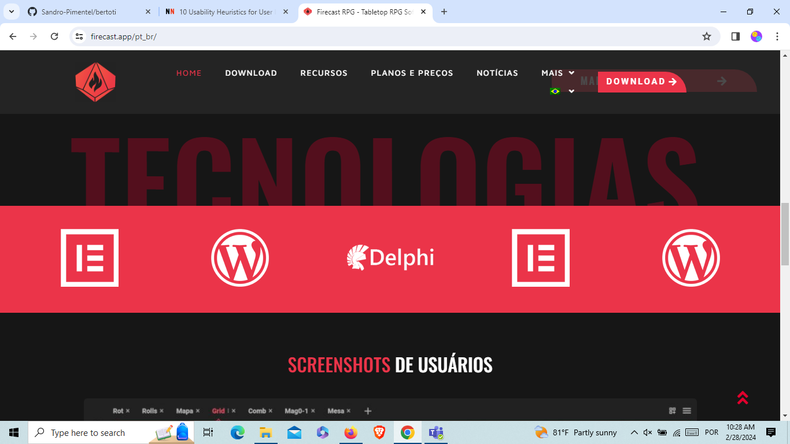
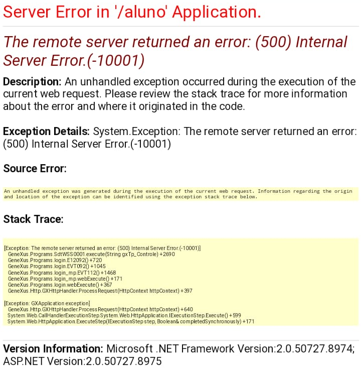
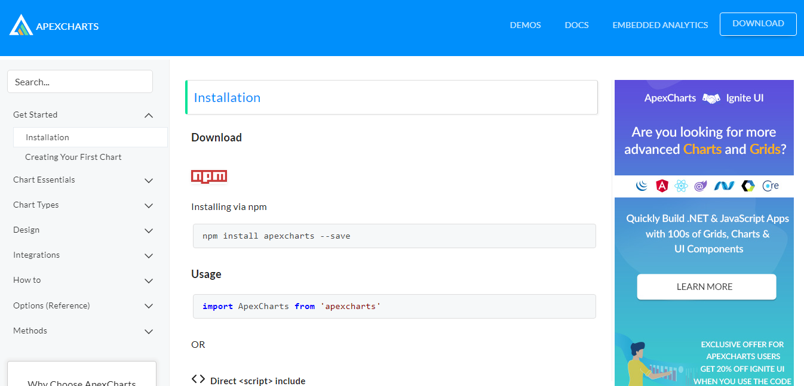

# 10 Eurísticas de Usabilidade para Interface de Usuário

- Visibilidade de Status do Sistema

- Conexão entre sistema e mundo real

- Controle de usuário e liberdade

- Consistência e padrões

- Prevenção de erro

 

- Regnition rather than recall

- Flexibilidade e eficiência de uso

- Estética e design minimalista

- Ajudar os usuários a reconhecer, diagnosticar e recuperar de erros

- Ajuda e Documentação

